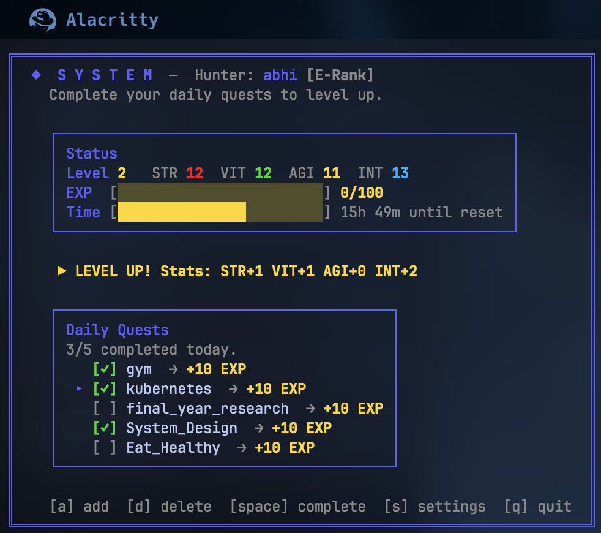
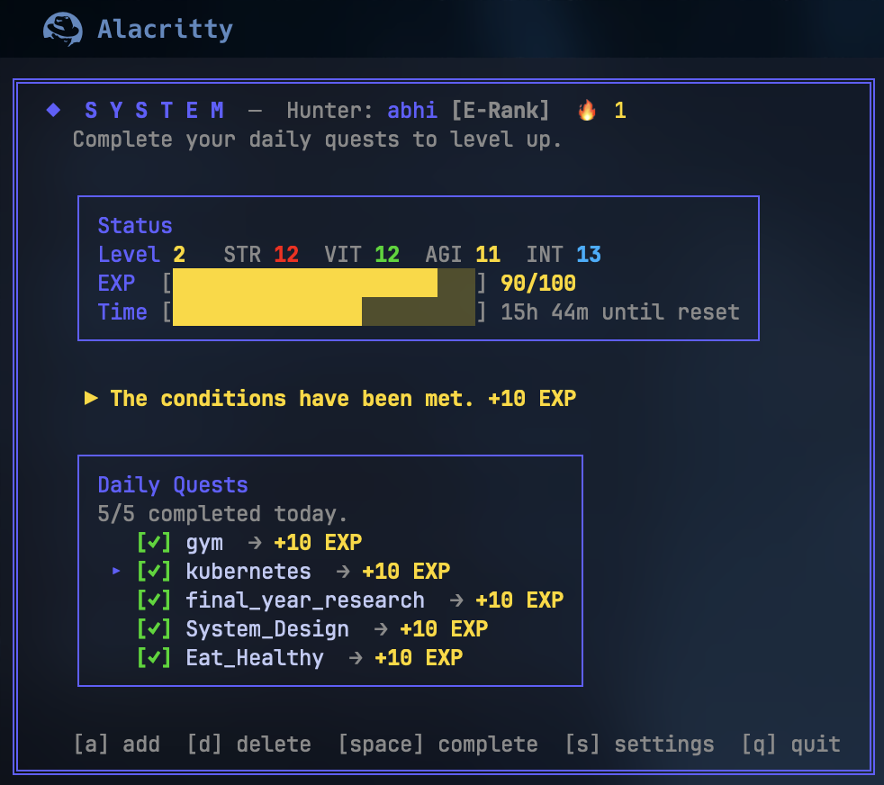

# SYSTEM - Solo Leveling Style Habit Tracker over SSH

A **Solo Leveling**–style daily habit tracker over SSH. Connect with SSH, then log in with your username and password in the app. Each account has its own quest log, level, stats, and EXP.

```bash
ssh -p 50526 system.hostagedown.com
```


<p align="center">
  
  
</p>

## Features

- **Username & password login** — After SSH connect, enter your credentials in the TUI
- **Register** — New users press `[r]` on the login screen to create an account
- **Daily quests** — Add habits as "daily quests"; complete them each day for EXP
- **Level & EXP** — +10 EXP per quest; level up every 100 EXP
- **AI-Powered Stats** — Gemini AI allocates STR, VIT, AGI, INT on level-up based on your habits
- **Hunter Ranks** — E-Rank → D → C → B → A → S-Rank based on level
- **Streak Tracking** — 🔥 Track consecutive days completing all quests
- **Custom Reset Time** — Press `[s]` to set when your day resets (default 4 AM)
- **Solo Leveling UI** — System window, colored stats, rank badges, EXP bar, time progress bar

## Hunter Rank System

| Level | Rank | Color |
|-------|------|-------|
| 1-5 | E-Rank | Gray |
| 6-10 | D-Rank | Orange |
| 11-20 | C-Rank | Green |
| 21-35 | B-Rank | Blue |
| 36-50 | A-Rank | Red |
| 51+ | S-Rank | Purple |

## Run

**Local (Go):**
```bash
export GEMINI_API_KEY="your-api-key"
go run ./cmd/server
```
The server auto-generates an SSH host key on first run if missing.

**Docker:**
```bash
docker compose up -d
```
User data is stored in the `system_data` volume. Set `GEMINI_API_KEY` in your environment for AI stat allocation.

## Connect

**Local:**
```bash
ssh -p 23234 user@localhost
```

**Production:**
```bash
ssh -p 50526 system.hostagedown.com
```

After connecting, the app shows **SYSTEM — LOGIN**. Enter your username, press Tab, enter your password, then Enter to log in. New users: press **r** to register.

## Controls

### Login / Register

| Key        | Action                |
|-----------|------------------------|
| **Tab**   | Switch between username and password |
| **Enter** | Submit (login or create account)     |
| **r**     | (on login) Switch to register       |
| **Esc**   | (on register) Back to login         |
| **q**     | Quit                                 |

### Main App

| Key        | Action                |
|-----------|------------------------|
| `a`       | Add new daily quest    |
| `d` / `x` | Delete selected quest  |
| `Space`   | Toggle complete today  |
| `s`       | Settings (reset time)  |
| `↑` / `k` | Move up                |
| `↓` / `j` | Move down              |
| `q`       | Quit                   |

## Data

- Stored under `data/<username>.json` (passwords are bcrypt hashes)
- Stats, streaks, and level persist across sessions
- Daily completions reset at your configured hour (default 4 AM)
- In Docker, mount a volume at `/app/data` to persist user data

## Environment Variables

| Variable | Description |
|----------|-------------|
| `GEMINI_API_KEY` | Required for AI-powered stat allocation on level-up |
